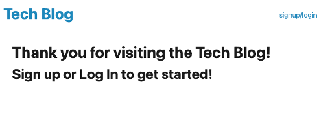
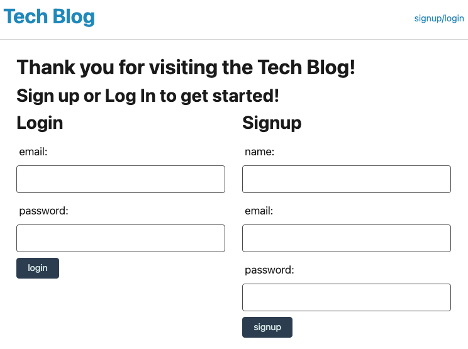
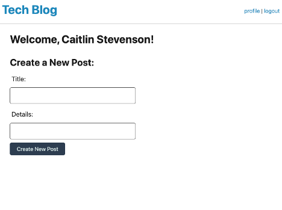

# Caitlin Stevenson|Tech Blog Assignment

## Objectives

In this project, I created an interactive tech blog application where users can create an account, create and delete their own posts, and comment on other users posts. 

## Tech Stack

HTML
CSS
JavaScript
Node
Bcrypt
Express-Sessions
Express-Handlebars
Dotenv
mySQL2
Sequelize

## Installation

To launch this application locally begin by cloning the repo down from the GitHub Repo [tech_blog](https://github.com/caitlinscodes/tech_blog). Once cloned run an `npm install` in your terminal and follow the steps below.

1. Set up your `.env` file using the `.env.EXAMPLE` file included in the cloned repo.

2. Create and seed your database using mySQL Workbench and the provided schema in the `db` file. Once your database has been created you can open your terminal and run the seed using the command `npm run seed`.

3. You can now run the application by entering `npm start` in your terminal. Once the app is listening you can navigate to localhost:3001 in your browser.

## Screenshots of Final Page

## Link To The Deployed Page

[Link to final webpage](https://fathomless-badlands-91714.herokuapp.com/ )

## Link To GitHub Repo

[Link to GitHub Repo](https://github.com/caitlinscodes/tech_blog)

## License

This code is licensed under the MIT License.